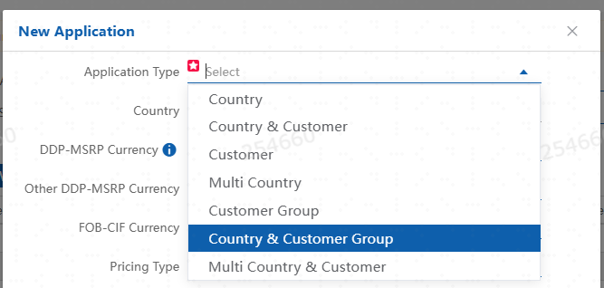
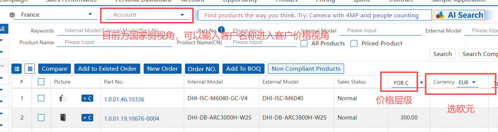
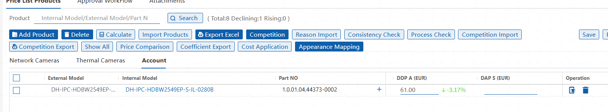

# 大华法子定价标准作业流程

> [!IMPORTANT]
> 该文档为大华法子定价标准作业流程，适用于大华法国子公司定价相关的工作流程和操作步骤。
> 如无权限定价请直接找到相关定价人员，切勿擅自定价报价。
> 对于无法拿准的部分，请及时与区域以及国内定价人员沟通确认。

## 1. 定价流程概述
定价分为法国国家侧定价和客户侧定价两部分，总共有如下定价层级  
  

对于Partenaires de distribution,其定价与Country侧定价相同，且不区分客户类型。
具体Partenaires de distribution列表可见
https://www.dahuasecurity.com/fr/partners/DistributionPartner

- Country侧定价：适用于所有客户的法国国家侧基础定价，并且对Partenaires de distribution直接生效  
- Country&Customer侧定价：适用于特定客户的定价，在此层级下定价将同时更新Country侧和Customer侧定价  
- Customer侧定价：适用于特定客户的定价，<u>仅对该客户生效，可能存在特殊的涨价系数或者折扣</u>
- Customer Group：适用于特定客户群体的定价，主要针对一些特殊客户群体，如IT Monitor, IT/ProAV Distributor, <u>仅对该客户群体生效，可能存在特殊的涨价系数或者折扣</u>
---
- Country & Customer Group侧定价：适用于特定客户群体的定价，在此层级下定价将同时更新Country侧和Customer Group侧定价, **从来不用**
- Multi Country侧定价：适用于多个国家的定价，主要针对跨国客户, **从来不用**

> [!NOTE]
> 对于部分小客户，比如PROTECPEO这些不在客户列表中的，需要咨询对应的销售和市场经历，很有可能也是与country侧定价相同

# 2. 定价操作步骤
进入 GSP 系统  
https://gsp.dahuasecurity.com/cpqMicro/#/

在收到销售或者市场的定价定价需求后，首先确认需求，常见两类为
1. 产品释放需求  
   
   该产品可能已有定价价格，但是销售侧不可见，正确释放后可见, 如果不是样机下单需求，那么全部按照official release进行释放操作
   具体操作步骤为：  
    **GSP -> Product -> Product Managerment -> Search Product -> 点击勾选对应产品 -> Release**  
   同时产品 Sale State为Delisting状态，那么**在产品右滑动侧 -> Edit 为Delisting Warning状态，然后修改其Delisting Time为下单日期之后**，确保正确下单，然后将操作告知销售，流程到此结束

2. 产品定价需求
   该产品目前无定价，需要新增定价，或者该产品已有定价，但是需要修改定价价格，正确操作后销售侧可见, 
   首先应当查看Product -> Product Category中搜索该产品， 在country视图或者customer视图中查看该产品是否已有定价，已有定价则去质问销售，流程到此结束  
   
   
   如果没有定价或者需要修改定价价格，那么按照以下步骤进行操作：
   
   具体操作步骤为：  
    **GSP -> Pricing -> Price List Application -> New Application -> Search Product -> 点击勾选对应产品**  
    

    只有产品在之前的步骤中被释放后，该页面下才可以进行定价  
    然后根据该产品对应的sales Type进行定价
    - SMB/Distribution -> FOB L 价格作为基础价格进行计算
    - Project -> FOB N 价格作为基础价格进行计算

    计算细节如下
    | 定价层级 | 计算方式 | 备注 |
    |---|---|---|
    | IPC / DDP A | FOB EURO*(1+10%)*(1+0.8%)*(1+2%)*(1+0.000198) |
    | HAC / DDP A | FOB EURO*(1+10%)*(1+0.8%)*(1+2%)*(1+0.000198) |
    | PTZ / DDP A | FOB EURO*(1+10%)*(1+0.8%)*(1+2%)*(1+0.000198) |
    | Thermal / DDP A | FOB EURO*(1+10%)*(1+0.8%)*(1+2%)*(1+0.000198) |
    | NVR / DDP A | FOB EURO*(1+10%)*(1+5.2%)*(1+2%)*(1+0.000198) |
    | IVSS / DDP A | FOB EURO*(1+10%)*(1+5.2%)*(1+2%)*(1+0.000198) |
    | EVS / DDP A | FOB EURO*(1+10%)*(1+5.2%)*(1+2%)*(1+0.000198) |
    | XVR / DDP A | FOB EURO*(1+10%)*(1+5.2%)*(1+2%)*(1+0.000198) |
    | Transmission / DDP A | FOB EURO*(1+10%)*(1+0%)*(1+2%)*(1+0.000198) |
    | IT交换机 路由器 / DDP A | FOB EURO*(1+10%)*(1+0%)*(1+2%)*(1+0.000198) |
    | VDP 可视对讲 / DDP A | FOB EURO*(1+10%)*(1+0%)*(1+2%)*(1+0.000198) |
    | Alarm / DDP A | FOB EURO*(1+5%)*(1+0%)*(1+2%)*(1+0.000198) |
    | Access Control / DDP A | FOB EURO*(1+10%)*(1+2.1%)*(1+2%)*(1+0.000198) |
    | Accessory / DDP A | FOB EURO*(1+10%)*(1+1.1%)*(1+2%)*(1+0.000198) |
    | Accessory 线缆 / DDP A | FOB EURO*(1+10%)*(1+3.7%)*(1+2%)*(1+0.000198) |
    | 监视器 / DDP A | FOB EURO*(1+10%)*(1+0%)*(1+2%)*(1+0.000198) |
    | IT监视器 / DDP A | FOB EURO*(1+10%)*(1+0%)*(1+2%)*(1+0.000198) |
    | 商显/TV-WALL / DDP A | FOB EURO*(1+10%)*(1+14%)*(1+2%)*(1+0.000198) |
    | 键盘/解码器 / DDP A | FOB EURO*(1+10%)*(1+3.4%)*(1+2%)*(1+0.000198) |
    | 交通 / DDP A | FOB EURO*(1+10%)*(1+0.8%)*(1+2%)*(1+0.000198) |
    | 车载前端 / DDP A | FOB EURO*(1+10%)*(1+0.8%)*(1+2%)*(1+0.000198) |
    | 车载后端 / DDP A | FOB EURO*(1+10%)*(1+5.2%)*(1+2%)*(1+0.000198) |
    | 硬盘/存储介质 / DDP A | FOB EURO*(1+10%)*(1+0%)*(1+2%)*(1+0.000198) |
    | 视频会议 / DDP A | FOB EURO*(1+10%)*(1+3.4%)*(1+2%)*(1+0.000198) |
    | 电子防盗门 EAS / DDP A | FOB EURO*(1+10%)*(1+0%)*(1+2%)*(1+0.000198) |
    | 安检机 / DDP A | FOB EURO*(1+15%)*(1+0%)*(1+2%)*(1+0.000198) |
    | 电子白板 / DDP A | FOB EURO*(1+15%)*(1+3.4%)*(1+2%)*(1+0.000198) | 取消DDP A价格，仅对欧供库存开放
    | 烟感 / DDP A | FOB EURO*(1+10%)*(1+2%)*(1+2%)*(1+0.000198) | 仅fob ddp
    | 充电桩 / DDP A | FOB EURO*(1+10%)*(1+2%)*(1+2%)*(1+0.000198) | 仅fob ddp
    | Alarm / DDP A | FOB EURO*(1+5%)*(1+0%)*(1+2%)*(1+0.000198) |
    | WIFI相机 / DDP A | FOB EURO*(1+5%)*(1+0%)*(1+2%)*(1+0.000198) |
    | Doorbell / DDP A | FOB EURO*(1+5%)*(1+0%)*(1+2%)*(1+0.000198) |

    在计算完成ddp价格后，按照以下步骤进行各层级定价操作：
    
    | 产品线 | 系列 | Reseller | Gold | Silver（SI） | Ivory（Installer） | MSRP |
    |---|---|---|---|---|---|---|
    | IPC | PSDW | DDP A / (1-12%) | DDP A / (1-22%) | DDP A / (1-30%) | DDP A / (1-35%) | Installer / (1-50%) |
    | IPC | 针孔 | DDP A / (1-12%) | DDP A / (1-25%) | DDP A / (1-30%) | DDP A / (1-35%) | Installer / (1-60%) |
    | IPC | IPC5 | DDP A / (1-12%) | DDP A / (1-27%) | DDP A / (1-30%) | DDP A / (1-35%) | Installer / (1-60%) |
    | IPC | IPC5/7/Multi-sensor / special | DDP A / (1-12%) | DDP A / (1-22%) | DDP A / (1-30%) | DDP A / (1-35%) | Installer / (1-60%) |
    | IPC | IPC3-S2 | DDP A / (1-12%) | DDP A / (1-22%) | DDP A / (1-30%) | DDP A / (1-35%) | Installer / (1-60%) |
    | IPC | ipc2-pro | DDP A / (1-12%) | DDP A / (1-25%) | DDP A / (1-30%) | DDP A / (1-35%) | Installer / (1-60%) |
    | IPC | IPC2 | DDP A / (1-12%) | DDP A / (1-20%) | DDP A / (1-30%) | DDP A / (1-35%) | Installer / (1-60%) |
    | IPC | IPC1 | DDP A / (1-12%) | DDP A / (1-20%) | DDP A / (1-25%) | DDP A / (1-30%) | Installer / (1-60%) |
    | HAC | HAC | DDP A / (1-12%) | DDP A / (1-17%) | DDP A / (1-20%) | DDP A / (1-25%) | Installer / (1-60%) |
    | PTZ | PTZ/SDT/Explosion proof / SD10/8 / 7 | DDP A / (1-12%) | DDP A / (1-22%) | DDP A / (1-30%) | DDP A / (1-35%) | Installer / (1-50%) |
    | PTZ | SD6/5/4/3/2/1 | DDP A / (1-12%) | DDP A / (1-22%) | DDP A / (1-30%) | DDP A / (1-35%) | Installer / (1-60%) |
    | Thermal | TPC | DDP A / (1-12%) | DDP A / (1-20%) | DDP A / (1-25%) | DDP A / (1-30%) | Installer / (1-20%) |
    | Thermal | TPC4 TPC5 | DDP A / (1-12%) | DDP A / (1-25%) | DDP A / (1-30%) | DDP A / (1-35%) | Installer / (1-20%) |
    | NVR | IVSS / NVR6 / NVR5- I/L | DDP A / (1-12%) | DDP A / (1-22%) | DDP A / (1-30%) | DDP A / (1-35%) | Installer / (1-50%) |
    | NVR | NVR5- EI/ NVR4 / NVR 2 | DDP A / (1-12%) | DDP A / (1-22%) | DDP A / (1-30%) | DDP A / (1-35%) | Installer / (1-50%) |
    | EVS |  |  | DDP A / (1-25%) | DDP A / (1-30%) | DDP A / (1-35%) | Installer / (1-40%) |
    | XVR | XVR | DDP A / (1-12%) | DDP A / (1-17%) | DDP A / (1-20%) | DDP A / (1-25%) | Installer / (1-60%) |
    | VDP |  | DDP A / (1-12%) | DDP A / (1-22%) | DDP A / (1-29%) | DDP A / (1-35%) | Installer / (1-50%) |
    | Access Control |  | DDP A / (1-12%) | DDP A / (1-22%) | DDP A / (1-35%) | DDP A / (1-40%) | Installer / (1-60%) |
    | Alarm |  | DDP A / (1-30%) | DDP A / (1-30%) | DDP A / (1-30%) | DDP A / (1-35%) | Installer / (1-60%) |
    | Transmission |  | DDP A / (1-12%) | DDP A / (1-20%) | DDP A / (1-23%) | DDP A / (1-25%) | Installer / (1-60%) |
    | Transmission L3 |  | DDP A / (1-12%) | DDP A / (1-20%) | DDP A / (1-23%) | DDP A / (1-25%) | Installer / (1-40%) |
    |  | 无线网桥 | DDP A / (1-12%) | DDP A / (1-16%) | DDP A / (1-21%) | DDP A / (1-26%) | Installer / (1-40%) |
    | Accessory | Accessory | DDP A / (1-12%) | DDP A / (1-22%) | DDP A / (1-30%) | DDP A / (1-35%) | Installer / (1-60%) |
    | Accessory | Accessory 线缆 | DDP A / (1-12%) | DDP A / (1-22%) | DDP A / (1-25%) | DDP A / (1-30%) | Installer / (1-60%) |
    | 监视器 / 商显 / LCD |  | DDP A / (1-12%) | DDP A / (1-15%) | DDP A / (1-20%) | DDP A / (1-25%) | Installer / (1-40%) |
    | 监视器 / 商显 / LCD | CCTV监视器 | DDP A / (1-12%) | DDP A / (1-20%) | DDP A / (1-22%) | DDP A / (1-25%) | Installer / (1-40%) |
    | 监视器 / 商显 / LCD | IT监视器 | DDP A / (1-12%) | DDP A / (1-15%) | DDP A / (1-15%) | DDP A / (1-15%) | Installer / (1-20%) |
    | 键盘/解码器 |  | DDP A / (1-15%) | DDP A / (1-25%) | DDP A / (1-30%) | DDP A / (1-35%) | Installer / (1-40%) |
    | 交通 / 停车场 |  | DDP A / (1-15%) | DDP A / (1-25%) | DDP A / (1-30%) | DDP A / (1-35%) | Installer / (1-40%) |
    | 车载 |  | DDP A / (1-15%) | DDP A / (1-25%) | DDP A / (1-30%) | DDP A / (1-35%) | Installer / (1-40%) |
    | 软件 |  | DDP A / (1-15%) | DDP A / (1-25%) | DDP A / (1-30%) | DDP A / (1-35%) | Installer / (1-60%) |
    | 硬盘/存储介质 |  | DDP A / (1-10%) | DDP A / (1-10%) | DDP A / (1-15%) | DDP A / (1-20%) | Installer / (1-20%) |
    | 视频会议 |  | DDP A / (1-15%) | DDP A / (1-25%) | DDP A / (1-30%) | DDP A / (1-35%) | Installer / (1-40%) |
    | 电子白板 |  | DDP A / (1-10%) | DDP A / (1-15%) | DDP A / (1-15%) | DDP A / (1-15%) | Installer / (1-20%) |
    | 安检机 |  | DDP A / (1-15%) | DDP A / (1-30%) | DDP A / (1-35%) | DDP A / (1-40%) | Installer / (1-40%) |
    | 电子防盗门 EAS |  | DDP A / (1-12%) | DDP A / (1-15%) | DDP A / (1-20%) | DDP A / (1-25%) | Installer / (1-40%) |
    | ESL |  | DDP A / (1-5%) | DDP A / (1-5%) | DDP A / (1-10%) | DDP A / (1-15%) | Installer / (1-40%) |
    | 充电桩 |  | DDP A / (1-10%) | DDP A / (1-15%) | DDP A / (1-15%) | DDP A / (1-15%) | Installer / (1-20%) |
    | Alarm |  | DDP A / (1-30%) | DDP A / (1-30%) | DDP A / (1-30%) | DDP A / (1-35%) | Installer / (1-60%) |
    | WIFI相机 |  | DDP A / (1-12%) | DDP A / (1-20%) | DDP A / (1-20%) | DDP A / (1-20%) | Installer / (1-20%) |
    | Doorbell |  | DDP A / (1-12%) | DDP A / (1-20%) | DDP A / (1-20%) | DDP A / (1-20%) | Installer / (1-20%) |

      在根据上述公式完成定价后填入系统中或按照特定格式的Excel表格进行批量上传，其定价字段为

      - Country 批量导入字段对应价格层级

      | xlsx字段 | 对应的价格层级和真实字段 |
      |---|---|
      | Part No. | PN |
      | FOB C | FOB C |
      | DDP A | DDP A |
      | Reseller S | Reseller |
      | SI-S | Gold |
      | SI-A | Silver |
      | MSTP | Ivory |
      | MSRP | MSRP |

      - Customer 批量导入字段对应价格层级

      | xlsx字段 | 对应的价格层级和真实字段 |
      |---|---|
      | Part No. | PN |
      | FOB C | FOB C |
      | DDP A | DDP A |
      | Reseller S | Reseller |
      | SI-S | Diamond |
      | SI-A | Gold |
      | MSTP | Ivory |
      | MSRP | MSRP |

     > [!IMPORTANT]
     > Diamond 和 Gold 定价等价  
    
    当价格全部录入后，点击提交 -> Save and Submit  
    进入Approval Workflow，然后写清理由后Submit进入审核流程
    
    完成后告知销售侧，流程到此结束，等待全部通过之后，价格会自动生效，销售侧可见

# 3. 注意事项
### 价格边上箭头作用
当填写或者导入完成价格后，当出现上下箭头标或者0%时，说明该产品已有定价，销售仍然反应无法查看时应该检查是否已经正确释放  

### Danger状态的产品
一些产品状态为danger的时候，其实该产品的价格已经存在了，只是设置了生效时间，还未生效。所以可以先在Price List Application 系统里检查

### 缺失系统价格
极少数情况下部分产品底价会有缺失，比如1.0.01.19.10066-0007，那么此时可以参考其基础料号 1.0.01.19.10066 底价进行定价计算

### 黑色型号定价
部分产品黑色型号为其白色型号的特殊定制款，Internal Model 含 'Black'，请核对是否存在对应白色型号（White），如存在，极有可能其定价是基于白色定价基础上+2欧元

