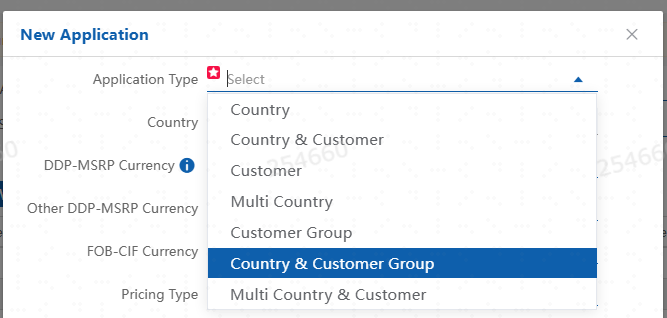
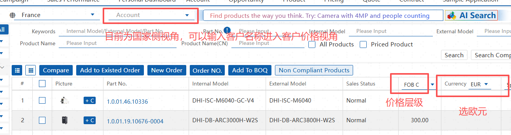
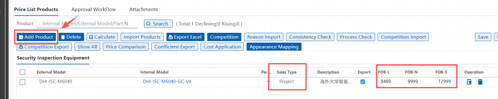
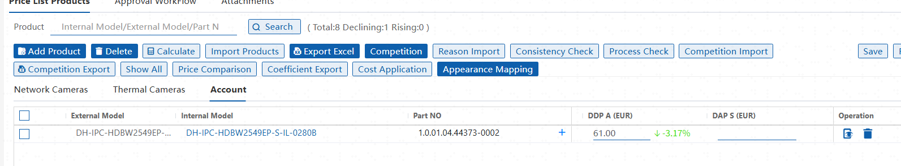

# 大华法国驻地定价自动化平台维护与作业手册

> [!IMPORTANT]
> 该文档同时面向业务使用人员和后续维护人员。
> 如无权限定价请直接联系对应定价人员，切勿擅自定价报价。
> 对于无法拿准的产品线、渠道系数或特殊客户场景，请及时与区域和国内定价人员确认。

## 1. 业务背景与定价层级

定价分为法国国家侧定价和客户侧定价两部分，总体层级如下：



对于 `Partenaires de distribution`，其定价与 Country 侧定价相同，且不区分客户类型。
分销商列表可参考：
https://www.dahuasecurity.com/fr/partners/DistributionPartner

常用层级说明：

- `Country`：法国国家侧基础定价，对分销商直接生效。
- `Country&Customer`：同时更新 Country 和 Customer 价格。
- `Customer`：只对特定客户生效，可能存在特殊折扣或涨价。
- `Customer Group`：只对特定客户群体生效，例如 IT Monitor、IT/ProAV Distributor。

不常用层级：

- `Country & Customer Group`：几乎不用。
- `Multi Country`：跨国客户场景，几乎不用。

> [!NOTE]
> 对于部分不在客户列表中的小客户，例如 `PROTECPEO`，需要先与销售或市场确认，很多情况下也是沿用 Country 侧价格。

## 2. GSP 业务操作流程

GSP 地址：
https://gsp.dahuasecurity.com/cpqMicro/#/

收到销售或市场的需求后，先判断属于下面哪一类。

### 2.1 产品释放需求

这类产品往往已经有价格，但销售侧不可见。正确释放后，销售端即可看到。

操作路径：

`GSP -> Product -> Product Management -> Search Product -> 勾选产品 -> Release`

注意事项：

- 如果不是样机下单需求，统一按 `official release` 操作。
- 如果产品 `Sale State` 为 `Delisting`，需要在右侧编辑栏改成 `Delisting Warning`，并把 `Delisting Time` 改到下单日期之后，确保能够正常下单。
- 操作完成后通知销售，流程结束。

### 2.2 产品定价需求

这类需求包括：

- 产品当前没有定价，需要新增价格
- 产品已有定价，但需要修改价格

第一步，先检查它是否真的没有价格：

`GSP -> Product -> Product Category`

在 `country` 或 `customer` 视图中先搜索对应产品，确认是否已有定价。
如果已经有价，先回头和销售确认需求是否重复。



如果确认需要新增或修改价格，再进入：

`GSP -> Pricing -> Price List Application -> New Application -> Search Product -> 勾选产品`



业务判断要点：

- 产品必须先被正确释放，价格申请页面才能定价。
- `Sales Type` 不同，使用的系统底价层级不同：
  - `SMB / Distribution`：使用 `FOB L`
  - `Project`：使用 `FOB N`
- 具体 DDP 和渠道价公式不在 README 里维护，实际以平台当前规则为准：
  - `RULES` 页当前值
  - `/data/dahua_pricing_runtime/admin/*.json`
  - 源码默认规则 `backend/engine/core/pricing_rules.py`

### 2.3 定价完成后的录入方式

完成价格确认后，通常有两种录入方式：

- 在 GSP 页面逐项填写
- 用平台导出的模板批量导入

当前平台统一导出的国家侧模板文件为：

- `Country_import_upload_Model.xlsx`

常用字段对应关系：

- `Part No.`：PN
- `FOB C`：FOB C(EUR)
- `DDP A`：DDP A(EUR)
- `Reseller S`：Reseller
- `SI-S`：Gold
- `SI-A`：Silver
- `MSTP`：Ivory
- `MSRP`：MSRP

历史上 `Customer` 模板里会出现 `Diamond`，当前维护口径里按 `Gold` 同类理解，落地时仍以实际模板和业务要求为准。

全部录入完成后：

1. 点击 `Save and Submit`
2. 进入 `Approval Workflow`
3. 填写原因并提交审核
4. 告知销售等待价格生效

## 3. 业务判断注意事项

### 3.1 价格边上的箭头或 0%

当价格填写或导入后，如果界面出现上下箭头或 `0%`，通常说明该产品已有价格。
如果销售仍然看不到，优先检查是否已经正确释放。



### 3.2 Danger 状态产品

有些产品显示为 `Danger`，并不代表没有价格，而是价格已经存在但还未到生效时间。
这种情况先去 `Price List Application` 里确认是否已有待生效价格。

### 3.3 系统底价缺失

极少数产品系统底价缺失，例如 `1.0.01.19.10066-0007`。
这时可以参考其基础料号 `1.0.01.19.10066` 的底价做业务判断。
平台内部也支持 base PN fallback，但最终仍建议人工复核。

### 3.4 黑色型号定价

如果 `Internal Model` 含 `Black`，请检查是否存在对应白色型号。
很多黑色型号本质是白色型号的定制变体，定价往往要基于白色版本做偏移，而不是独立重新计算。

## 4. 自动化平台怎么用

### 4.1 QUERY

用途：

- 单 PN 查询
- 查看 France / Sys 命中情况
- 查看自动识别到的产品线、子线、系列
- 查看价格来自 France、Sys 反算、关键词叠加还是 External Model 锚点
- 手动指定产品线重算
- 导出单个 PN 的上传模板

你在 Query 页重点要看：

- `法国国家侧匹配`
- `系统侧匹配`
- `计算状态`
- `计算层级`
- `Calc Layer (Sys)`
- `Sys Basis Price Used`

### 4.2 扩展索引模式（External Model）

勾选 `扩展索引模式（External Model）` 后，平台会：

1. 先取当前 PN 的 `External Model`
2. 在 France 表和 Sys 表中找出所有相同 `External Model` 的产品
3. 列出这些产品各自价格、内部型号、发布状态等信息
4. 如果法国侧已有同 External Model 且价格完整的锚点行，可用法国锚点覆盖整个集群
5. 支持把整个集群导出成上传模板

这个模式适合处理一组同模产品或尾缀不同、但本质同价的 PN。

### 4.3 BATCH

用途：

- 上传 txt / csv / xlsx / xls 批量计算
- 后端后台异步生成结果
- 下载可直接上传 GSP 的模板

适合做：

- 一次性新产品批量定价
- 规则更新后的抽样复核
- 某个产品线的成批导出

### 4.4 RULES

用途：

- 维护 DDP 规则
- 维护渠道价规则
- 维护 Sys FOB Adjust

保存逻辑：

- `SAVE+RELOAD` 会把规则写入 runtime
- 后端内存中的规则会同步更新
- 这里改的是线上当前生效值，不只是前端展示

### 4.5 KEYWORD

用途：

- 维护关键词额外涨价规则
- 预览哪些 PN 会受到影响

当前规则：

- 关键词只在 `Internal Model / External Model` 中匹配
- 关键词涨价只在 `France FOB 缺失 + Sys 反算 FOB` 场景生效
- Preview 只展示价格真正发生变化的 PN

### 4.6 META

用途：

- 查看当前引擎是否已加载
- 查看 France / Sys 数据更新时间
- 查看当前使用的数据文件和 mapping 文件路径

更新数据表或重启服务后，先看这页确认是否加载到了新的数据。

## 5. 仓库结构

```text
/data/Dahua_Pricing_Auto
├── backend/
│   ├── app/main.py                # FastAPI 入口，API、批量任务、规则持久化
│   └── engine/
│       ├── engine.py              # PricingEngine 壳层
│       └── core/
│           ├── loader.py          # 读取 France/Sys Excel、mapping CSV，建立索引
│           ├── classifier.py      # 产品线识别、系列识别、强制业务修正
│           ├── pricing_engine.py  # 单个 PN 的核心计算链路
│           ├── pricing_rules.py   # 默认 DDP_RULES / PRICE_RULES
│           └── formatter.py       # 导出模板格式化与分段取整
├── frontend/
│   ├── src/App.jsx                # QUERY / BATCH / RULES / KEYWORD / META
│   └── dist/                      # 构建后的静态文件，由 nginx 提供
├── deploy/
│   ├── nginx/                     # nginx 站点配置
│   ├── systemd/                   # dahua-pricing-backend.service
│   └── scripts/                   # 持久化部署、mapping 审计和重建
├── mapping/                       # 仓库内默认 mapping CSV
├── script/                        # 常用重启脚本
└── readme.md
```

> [!NOTE]
> 当前线上主链路以 `backend/` + `frontend/` + `deploy/` + `runtime` 为准。
> 仓库根目录中仍保留一些历史文件，例如 `main.py`、`gui_app.py`、`export.py`、旧模板、旧 PDF，这些不是当前 Web 平台的核心入口。

## 6. Runtime 结构

```text
/data/dahua_pricing_runtime
├── data/
│   ├── FrancePrice.xlsx
│   └── SysPrice.xlsx
├── mapping/
│   ├── productline_map_france_full.csv
│   └── productline_map_sys_full.csv
├── admin/
│   ├── ddp_rules.json
│   ├── price_rules.json
│   ├── uplift.json
│   └── keyword_uplift.json
├── uploads/                       # 批量任务上传源文件
├── outputs/                       # 单查导出、批量导出、external model 导出
└── logs/                          # 任务日志、mapping 审计结果
```

请记住一条最重要的维护原则：

- 代码里的 `pricing_rules.py` 是默认值
- `/data/dahua_pricing_runtime/admin/*.json` 才是线上当前生效值

也就是说，日常在 `RULES` 或 `KEYWORD` 页改的内容，本质上是在改 runtime 规则，而不是只改前端展示。

## 7. 系统架构与运行原理

### 7.1 整体架构

```text
Browser
  -> nginx
    -> frontend/dist 静态页
    -> /api/* 反代到 FastAPI
FastAPI
  -> PricingEngine
    -> FrancePrice / SysPrice
    -> France / Sys mapping
    -> runtime/admin 规则覆盖
    -> Query / Batch / Rules / Keyword / External Model
Runtime
  -> data / mapping / admin / uploads / outputs / logs
```

### 7.2 启动时做了什么

后端在 `backend/app/main.py` 的 `startup` 阶段会完成：

1. 准备 runtime 目录
2. 加载 runtime 下的规则覆盖文件
3. 构建 `PricingEngine`
4. 从 `runtime/data` 读取 France 与 Sys 两张价格表
5. 从 `runtime/mapping` 读取 France 与 Sys 两套 mapping
6. 建立原始 PN 索引与 base PN 索引

### 7.3 单个 PN 的计算链路

核心计算逻辑在 `backend/engine/core/pricing_engine.py`：

1. 先按原始 PN 精确匹配 France 和 Sys
2. 如果精确匹配失败，再尝试 base PN fallback
3. 根据 France / Sys 行和 mapping 识别：
   - `category`
   - `price_group`
   - `series_display`
   - `series_key`
4. France 价格优先
5. France 的 `FOB C(EUR)` 缺失时，才允许使用 Sys 底价反算 FOB
6. Sys 反算 FOB 时，可能继续叠加：
   - `Adjust`
   - `Keyword uplift`
7. 继续算出 DDP 和渠道价
8. 返回诊断信息供前端展示

### 7.4 关键业务规则

- France 价格优先于 Sys
- `Adjust` 和关键词额外涨价只在 Sys 反算 FOB 时生效
- 同一 External Model 可作为一个价格集群处理
- 如果法国侧存在完整锚点价，可覆盖 External Model 集群
- 导出模板统一使用 country 结构
- 导出格式会按本地规则做分段处理：
  - `< 30` 保留 2 位小数
  - `>= 30` 四舍五入取整

### 7.5 为什么 mapping 很重要

平台不是单靠硬编码识别产品线，而是依赖：

- `productline_map_france_full.csv`
- `productline_map_sys_full.csv`

同时 `classifier.py` 还会做少量强制业务修正，例如：

- 人行道闸统一归到 `ACCESS CONTROL`
- 录像机相关类目兜底识别
- IPC / PTZ / Thermal 等产品系列识别

当自动识别不准确时，优先检查 mapping，而不是先改公式。

## 8. 日常维护操作

### 8.1 更新 France / Sys 数据表

替换下面两个文件：

- `/data/dahua_pricing_runtime/data/FrancePrice.xlsx`
- `/data/dahua_pricing_runtime/data/SysPrice.xlsx`

然后重启后端：

```bash
cd /data/Dahua_Pricing_Auto
bash script/restart_backend.sh
```

最后去 `META` 页确认更新时间是否已更新。

### 8.2 更新 mapping

如果只是微调规则，可直接修改：

- `/data/dahua_pricing_runtime/mapping/productline_map_france_full.csv`
- `/data/dahua_pricing_runtime/mapping/productline_map_sys_full.csv`

修改后重启后端即可。

如果要基于当前价格表重建 mapping，可使用：

```bash
cd /data/Dahua_Pricing_Auto
python3 deploy/scripts/rebuild_mapping_from_prices.py
python3 deploy/scripts/mapping_audit.py
```

相关审计结果会写入：

- `/data/dahua_pricing_runtime/logs/mapping_audit/`

### 8.3 更新规则

优先建议：

- 日常调整：在前端 `RULES` / `KEYWORD` 页修改并保存
- 版本基线调整：再同步回源码默认值

线上当前规则文件：

- `/data/dahua_pricing_runtime/admin/ddp_rules.json`
- `/data/dahua_pricing_runtime/admin/price_rules.json`
- `/data/dahua_pricing_runtime/admin/uplift.json`
- `/data/dahua_pricing_runtime/admin/keyword_uplift.json`

### 8.4 重启服务

后端：

```bash
cd /data/Dahua_Pricing_Auto
bash script/restart_backend.sh
```

前端：

```bash
cd /data/Dahua_Pricing_Auto
bash script/restart_frontend.sh
```

前后端一起：

```bash
cd /data/Dahua_Pricing_Auto
bash script/restart_all.sh
```

### 8.5 持久化部署

```bash
cd /data/Dahua_Pricing_Auto
sudo bash deploy/scripts/deploy_persistent.sh
```

部署脚本会完成：

- 安装 nginx 和 python venv
- 准备 runtime 目录
- 同步 mapping 到 runtime
- 构建前端
- 安装 systemd 服务
- 安装 nginx 站点配置

## 9. 排障建议

### 9.1 改了规则但价格没变

优先检查：

- 这条 PN 是否本来就走 France 原价
- 是否确实触发了 Sys 反算 FOB
- `Adjust` 或关键词涨价是否满足生效条件
- 改动是否已经保存到 runtime/admin

### 9.2 出现 502

最常见原因：

- 后端或 nginx 正在重启
- 后端还没启动完成，nginx 已开始转发请求

检查命令：

```bash
systemctl status dahua-pricing-backend.service --no-pager
systemctl status nginx --no-pager
```

### 9.3 自动识别结果不对

优先检查：

1. France / Sys mapping 是否该加规则
2. 是否命中了错误的 contains 规则
3. 是否属于 classifier 里的业务强制修正场景
4. 是否应该手动重算验证

### 9.4 平台和 GSP 结果不一致

优先检查：

- 产品是否已经正确 release
- GSP 是否已有待生效价格
- 是否导入到了错误层级
- 是否使用了错误模板
- 是否引用了旧导出文件

## 10. 关键文件索引

- 后端入口：`backend/app/main.py`
- 引擎壳层：`backend/engine/engine.py`
- 数据加载：`backend/engine/core/loader.py`
- 分类识别：`backend/engine/core/classifier.py`
- 核心计算：`backend/engine/core/pricing_engine.py`
- 默认规则：`backend/engine/core/pricing_rules.py`
- 导出格式：`backend/engine/core/formatter.py`
- 前端页面：`frontend/src/App.jsx`
- 持久化部署：`deploy/scripts/deploy_persistent.sh`
- Mapping 重建：`deploy/scripts/rebuild_mapping_from_prices.py`
- Mapping 审计：`deploy/scripts/mapping_audit.py`
- 重启脚本：`script/restart_backend.sh`、`script/restart_frontend.sh`、`script/restart_all.sh`
